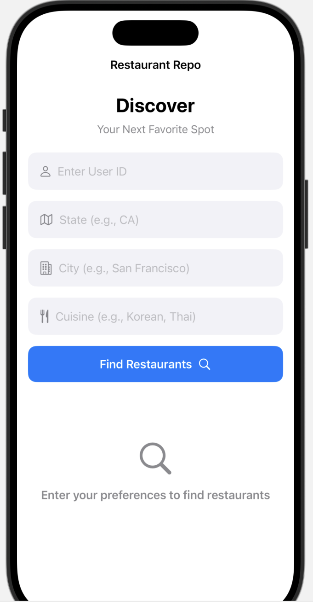
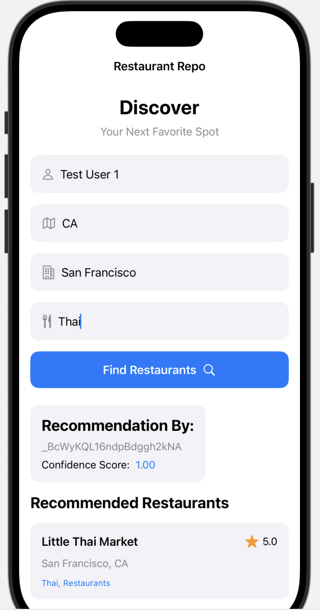
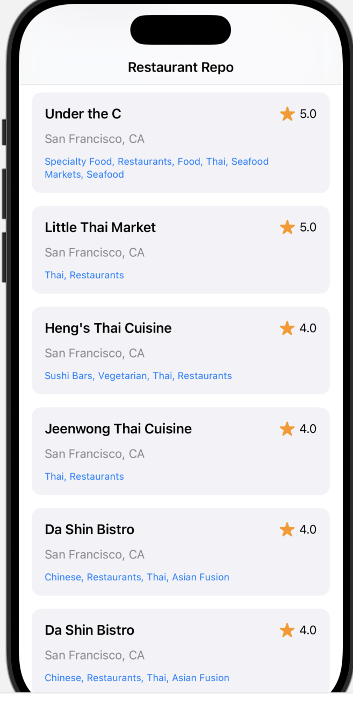

## Swift iOS Application for Personalized Restaurant Recommendation.

The companion [recommendation engine](https://github.com/smkim0508/Food_Preference_Indexer) is built by training on the [Yelp Business Reviews Dataset](https://www.kaggle.com/datasets/yelp-dataset/yelp-dataset?select=yelp_academic_dataset_business.json), available on Kaggle.

To run, simply start up the Swift application on iOS IDE like Xcode.

You can search for restaurant recommendations by entering your Yelp User ID and (optionally) specifying the location or cuisine that you are looking for. The app will fetch your past Yelp review data to recommend you restaurants using an algorithm similar to collaborative filtering, specifically designed for food preferences!

Demo Application Shown Below:

- Landing Page

    

- Example Restaurant Search

    

- Scrolling Results

    

